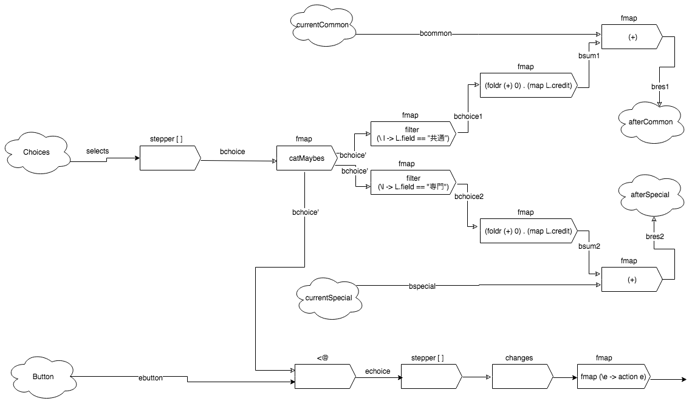

# リアクティブプログラミングのMVCへの適用に関する考察

## はじめに
　本研究では、近年インタラクティブなプログラムの実装手法として有効なReactive Programmingが注目されている。RPの具体的な手法の１つとしてFunctional Reactive Programmingというパラダイムがある。
　そのFRPが、MVCアーキテクチャにおいて有用性があるのかを実際にFRPライブラリを用いたソフトウェア開発を通して調査する。

## 仕様
　本研究で、開発するソフトウェアの仕様の概念は、大学の履修登録をおこなうアプリケーションである。具体的な仕様は、次のように定義する。
    - 学期の情報を表示
    - 学生の情報の表示
    - 講義についての選択メニューの設置
    - 現在の総取得単位数の表示
    - 履修後の総単位数の表示
    - 登録ボタンの設置
　これらの仕様を満たすソフトウェアの開発を通してFRPがMVCにおいて有用であるのか調査する。

## 実装
　仕様を満たすソフトウェアの起動時の画面を下記に示す。

　この画面において、講義の選択が行われた場合、次のように変化する。

　MVCアーキテクチャにおいて、ModelとViewのやり取りはObserverパターンを用いて実装されることがある。本研究では、ModelとViewのやり取りの実装にFRPシステムを用いることにした。
　イベントロジックは、次の図のように実装した。

## 評価
　FRPシステムを用いたソフトウェア開発を通して、次の点からFRPシステムは有用性があると言える。
    - コンポーネントの状態を管理する必要がない。
    - 解決すべき問題に集中して開発を進めることができる。
    - 入出力とロジックを明確に分離できる。

## まとめ
 - 実際にFRPシステムを用いたソフトウェア開発を行い、有用性を調査した。
 - その結果、コンポーネントの状態を開発者が管理する必要がなく、そのため開発者は解決すべき問題に集中して開発を進めることができた。
 - FRPは、イベントベースのソフトウェア開発において有用であるため、とても有効な選択の１つとなり得る。

## 参考文献
 [1] Conel Elliot, Paul Hudak (1997)『Functional Reactive Animation』 
 [2] Conel Elliot (2007) 『Push-Pull Functional Reactive Programming』 
 [3] Stephen Blackheath, Anthony Jones (2017) 『関数型リアクティブプログラミング』翔泳社  
 [4] 「FRP explanation using reactive-banana」<https://wiki.haskell.org/FRP_explanation_using_reactive-banana>  
