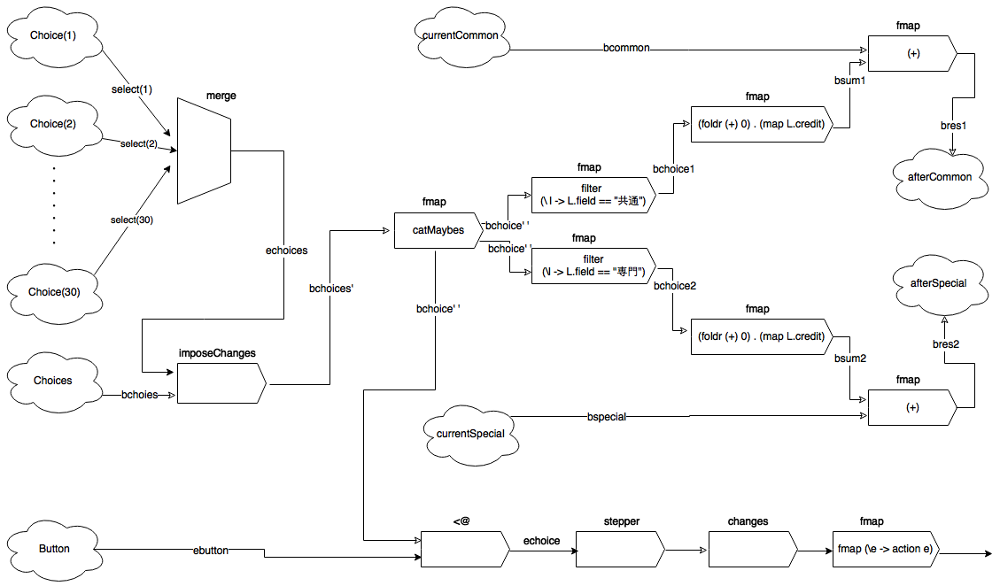

# リアクティブプログラミングのMVCへの適用に関する考察

## 目次
 1. [背景](#Background)
 2. [Reactive Programming](#RP)
 3. [Functional Reactive Programming](#FRP)
 4. [仕様](#Specification)
 5. [実装](#Implementation)
 6. [評価](#Evaluation)
 7. [まとめ](#Summary)
 8. [参考文献](#Reference)

<a name="Background"></a>
## 1. 背景
 　近年インタラクティブなプログラミングに有効であるパラダイムであるリアクティブプログラミングが注目されている。リアクティブプログラミングとは、イベントベースであり、入力に応じて振る舞い、プログラムをデータフローとして見ることができるようにプログラムを定義するパラダイムである。リアクティブプログラミングは、あくまでも先ほど述べたような特徴をもつプログラムを定義しているだけであり、具体的にどのような手法を用いてリアクティブなプログラムを定義するのかまでは定義されていない。そこで具体的なリアクティブプログラミングの実現手法として、関数型リアクティブプログラミングがある。このパラダイムは、関数型プログラミングのルール（特に合成性）を用いてリアクティブプログラミングを実現する具体的な手法である。関数型リアクティブプログラミングは、1997年のConel Elliot, Paul Hudakによって発表された「Functional Reactive Animation」によって概念が定義され、2007年のConel Elliotによって発表された「Push-Pull Functional Reactive Programming」によって正式に定義された。  
 　このパラダイムの概念を用いると、開発者が状態を管理する必要がなくなるという点があり、イベントベースのプログラムで用いられることのあるObserverパターンよりも優れ、Observerパターンに変わるものであるとブログや記事で紹介されている。  
 　よって、本研究では、関数型リアクティブプログラミングが本当にObserverパターンよりも有用なイベントベースプログラムの実装方法であるのか調査する。ただし、Observerパターンが適用することのできる仕様をもつプログラム全てに対して調査することは不可能であるため、本研究では、MVCにおけるModelとViewのやり取りの実装に、Observerパターンではなく関数型リアクティブプログラミングを用いて、MVCにおいて関数型リアクティブプログラミングが有用であるのか調査する。  
 　調査の方法は、関数型リアクティブプログラミングを実現するためのライブラリを用いて、実際のソフトウェア開発を行う。そのソフトウェア開発において、有用性を感じることができたか、またはできなかったかを具体的な点を交えて記述し、それを評価とする。また、議論では、MVCに限らずObserverパターンが用いられている部分に対して関数型リアクティブプログラミングが有用となり得るのか、本研究のソフトウェア開発を通して得た評価から推測しまとめ、それを記述する。

<a name="RP"></a>
## 2. Reactive Programming（RP）
 　リアクティブプログラミングとは、イベントベースであり、入力に応じた振る舞いをし、データフローとして見ることのできるプログラムを定義するパラダイムである。しかし、具体的にどのようにこれらの特徴を持つプログラムを定義するのかは定義されていない。  
 　リアクティブプログラミングが適用されているプログラムの直感的な動作として身近なものは、スプレッドシートである。

 

 　例えば、Anに商品の定価、B1に消費税率、Cnに商品の税込みの価格を示す値（状態）を持っているとする。この時、CnはAnまたはB1のイベントに依存している。すなわち、AnまたはB1においてイベントが発生した場合、Cnの値はAnまたはB1の入力に応じて状態を自ら更新する。リアクティブプログラミングの適用されているプログラムは、あるイベントに依存している状態は、依存しているイベントが発生した際に、そのイベントに応じて自ら状態を最新の状態に更新する。

<a name="FRP"></a>
## 3. Functional Reactive Programming（FRP）
 　関数型リアクティブプログラミングとは、関数型プログラミングを用いて、リアクティブプログラミングを実現するパラダイムである。関数型プログラミングとは、数学的な意味の関数に基づいてプログラミングを行うパラダイムである。関数型リアクティブプログラミングにおいて、重要な2つのデータ型（`Event`と`Behavior`）と10個のプリミティブ操作がある。

#### Event
 Eventは、一連のイベントを示すデータ型である。Eventが値（オカレンス）を持つのはイベントが発生した時のみである。Reactive Bananaでは次のように考えることができる。

 ``` haskell
 type Event a = [(Time, a)]

 ```

 またEventは、Functorのインスタンスである。

 ``` haskell
 instance Functor Event where
    fmap :: (a -> b) -> Event a -> Event b
    fmap f e = [(time, f a) | (time, a) <- e]
 ```


#### Behavior
 Behaviorは、時間とともに変化する値を示すデータ型である。Behaviorは、常に値を持つ。Reactive Bananaでは次のように考えることができる。

 ``` Haskell
 type Behavior a = Time -> a
 ```

 またBehaviorは、Applicativeのインスタンスである。

 ``` Haskell
 instance Functor Behavior where
    fmap :: (a -> b) -> Behavior a -> Behavior b
    fmap f b = \time -> f (b time)

 instance Applicative Behavior where
    pure :: a -> Behavior a
    pure x = \time -> x

    (<*>) :: Behavior (a -> b) -> Behavior a -> Behavior b
    fx <*> bx = \time -> fx time $ bx time
 ```

#### プリミティブ操作

 ``` Haskell
 -- EventまたはBehaviorを変換する操作
 fmap :: (Functor f) => (a -> b) -> f a -> f b

 -- Eventの値をBehaviorに保存する操作
 stepper :: a -> Event a -> Behavior a

 -- 定数値を持つBehaviorを出力する操作
 pure :: (Applicative f) => a -> f a

 -- Eventをマージする操作
 union :: [Event (a -> a)] -> Event a

 -- Eventに応じてBehaviorの値を取得する操作
 (<@>) :: Behavior (a -> b) -> Event a -> Event b
 (<@)  :: Behavior b -> Event a -> Behavior b

 -- Eventを随時伝播させる操作
 filterE :: (a -> Bool) -> Event a -> Event a

 -- Behaviorを結合する操作
 (<*>) :: Behavior (a -> b) -> Behavior a -> Behavior b

 -- 決して発火しないEventを出力する操作
 never :: Event a

 -- Behaviorの値を取得する操作
 valueB      :: (MonadMoment m) => Behavior a -> m a
 valueBLater :: (MonadMoment m) => Behavior a -> m a

 -- 新たなデータフローを出力する操作  
 switchE :: (MonadMoment m) => Event (Event a) -> m (Event a)
 switchB :: (MonadMoment m) => Behavior a -> Event (Behavior a) -> m (Behavior a)
 ```

#### FRPシステムのI/O
 　FRPシステムのI/Oは、MomentIOモナド内で行う。入力に関連する関数は、主に`fromAddHandler`と`fromChanges`であり、出力に関連する関数は、`reactimate`と`reactimate'`である。それぞれ詳細は後述する。なお、ここでのFRPシステムとは、Reactive Bananaを指しており、後述の説明が他のFRPシステムにおいて当てはまるとは限らない。

#### FRPシステムへの入力
 　FRPシステムへの入力は、`Handler a`と`AddHandler a`を利用する。各データ型は、`Control.Event.Handler`において次のように定義されている。各データ型の生成は、`newAddHandler :: IO (AddHandler a, Handler a)`によって行う。

 ```Haskell

 -- FRPシステムの外で利用する。
 type Handler a = a -> IO ()

 -- FRPシステムの中で利用する。
 newtype AddHandler a = Handler a -> IO (IO())

 -- Handler aとAddHandler aの生成
 (addHandler, runHandler) <- newAddHandler

 ```

 `AddHandler a`は、EventまたはBehaviorを出力するために、`fromAddHandler :: AddHandler a -> MomentIO (Event a)`または`fromChanges :: a -> AddHandler a -> MomentIO (Behavior a)` の入力として使用される。`Handler a`は、FRPの外で用いられ、実行されるとFRP内にa型のデータが入力され、EventまたはBehaviorとして出力される。

 ```Haskell
 do
    (addHandler, runHandler) <- newAddHandler

    let networkDescription = do
        -- runHandlerが実行されるとEventが発火する
        e <- fromAddHandler addHandler
                ・
                ・
                ・
    ・
    ・
    ・
    forever $ fmap read getLine >>= runHandler
 ```

#### FRPシステムからの出力
 　FRPシステムからの出力は、`reactimate :: Event (IO ()) -> MomentIO ()`または`reactimate' :: Event (Future (IO ())) -> MomentIO ()`で行う。ただし、2つのEventがほぼ同時に発火した場合、各Eventに適用された`reactimate`はインターリーブされる。`reactimate'`は、`Event (Future (IO ()))`を入力とし、`MomentIO ()`のアクションを実行する。`Future a`は、イベント処理が完了したのちに`MomentIO ()`のアクションを実行することを保証する。

 ```Haskell
 do
    (addHandler, runHandler) <- newAddHandler

    let networkDescription = do
        e <- fromAddHandler addHandler
        -- Event IntからEvent (IO ())に変換し、Event (IO ())が持つIO ()を実行する。
        reactimate $ (\x -> putStrLn $ replicate x "*") <$> e
    ・
    ・
    ・
    forever $ fmap read getLine >>= runHandler
 ```

#### まとめ
 　標準入力から数字を入力し、数字の分だけ' * 'を出力するプログラムをReactive Bananaを用いて実装した。そのプログラムを下記に示す。

 ```Haskell
 module Main
    ( main
    ) where

 import Control.Monad
 import Reactive.Banana
 import Reactive.Banana.Frameworks

 main :: IO ()
 main = do
    (addHandler, runHandler) <- newAddHandler

    let networkDescription :: MomentIO ()
        networkDescription = do
            e <- fromAddHandler addHandler
            reactimate $ (\x -> putStrLn $ replicate x '*') <$> e

    -- MomentIO ()をEventNetworkにコンパイルする。
    network <- compile networkDescription

    -- EventNetworkを実行する。
    actuate network

    forever $ fmap read getLine >>= runHandler
 ```

 `compile :: MomentIO () -> IO EventNetwork`は、FRPを用いて定義したイベントロジックを`EventNetwork`にコンパイルする。`EventNetwork`は、コンパイルされたイベントロジックを示すデータ型であり、実行中または停止中の２つの状態を取りうる。`EventNetwork`を実行状態にするには、`actuate :: EventNetwork -> IO ()`を用いる。一方、停止状態にするには、`pause :: EventNetwork -> IO ()`を実行する。

<a name="Specification"></a>
## 4.仕様
 　本研究で開発するソフトウェアの仕様は次のように定義する。

 <details><summary>学期情報の表示する。</summary><br>
 学期情報とは、現在行われている履修登録が前期に受ける講義の選択なのか後期に受ける講義の選択であるのか示す情報である。また、履修登録期間も表示する。これらの情報は全てテキストによって表示される。
 </details>

 <br>

 <details><summary>学生情報の表示する。</summary><br>
 学生情報とは、次の属性を持つ情報である。
 <ul>
    <li>学生証番号</li>
    <li>氏名</li>
    <li>セメスター</li>
    <li>学部</li>
    <li>学科</li>
 </ul>
 これらは全てテキストで表示される。
 </details>

 <br>

 <details><summary>講義選択を行う選択メニューの設置する。</summary><br>
 講義の情報は次のような属性を持つ情報である。
 <ul>
    <li>ID</li>
    <li>講義名</li>
    <li>分野</li>
    <li>開講期間</li>
    <li>単位</li>
 </ul>
 ただし、IDは講義において一意に決まる数値を示し、分野は共通または専門のどちらかを示す情報であり、開講期間は前期または後期の情報と何曜日の何時限目に行われる講義であるのかを示す情報である。また,月曜日から土曜日の一限目から五限目まで開講している大学を想定している。これらは、選択メニューのコンポーネントによって示される。
 </details>

 <br>

 <details><summary>現在の総取得単位数の表示する。</summary><br>
 現在の総取得単位数は、履修登録をしている学生の現在取得している単位の合計である。この情報は、テキストによって示される。<br>
 </details>

 <br>

 <details><summary>講義選択後の総単位数の表示する。</summary><br>
 講義選択後の総単位数は、現在の総取得単位数と選択した講義の単位全ての合計との和である。この情報はテキストによって示される。
 </details>


<a name="Implementation"></a>
## 5.実装
 次の環境の元で、定義した仕様を満たすソフトウェアを開発する。

### 開発環境
 <dl>
    <dt>プラットフォーム</dt>
    <dd><table>
        <tr>
            <th>マシン</th>
            <th>オペレーティングシステム</th>
            <th>プロセッサ</th>
            <th>メモリ</th>
        </tr>
        <tr>
            <td>Apple Macbook Air(11-inch, Mid2013)</td>
            <td>macOS-ver10.13.3</td>
            <td>1.3GHz-intel-Core-i5</td>
            <td>4GB-1600MHz-DDR3</td>
        </tr>
    </table></dd>

    <dt>DBMS</dt>
    <dd>PostgreSQL(ver10.1)</dd>

    <dt>言語</dt>
    <dd><table>
        <tr>
            <th>言語</th>
            <th>コンパイラ</th>
            <th>ビルドツール</th>
        </tr>
        <tr>
            <td><a href=https://www.haskell.org/>Haskell</a></td>
            <td>GHC(ver8.0.2)</td>
            <td><a href=https://docs.haskellstack.org/en/stable/README/>Haskell Stack(ver1.6.3)</a></td>
        </tr>
    </table></dd>

    <dt>パッケージ</dt>
    <dd>
        <ul>
            <li><a href=https://hackage.haskell.org/package/HDBC>HDBC(ver2.4.0.2)</a></li>
            <li><a href=https://hackage.haskell.org/package/relational-record-0.1.8.0>relational-record(ver0.1.8.0)</a></li>
            <li><a href=https://hackage.haskell.org/package/wx>wx(ver0.92.3.0)</a></li>
            <li><a href=https://hackage.haskell.org/package/reactive-banana>reactive-banana(ver1.1.0.1)</a></li>
            <li><a href=https://hackage.haskell.org/package/reactive-banana-wx>reactive-banana-wx(ver1.1.1.0)</a></li>
        </ul>
    </dd>
    <dd>ただし、これらのパッケージが依存しているパッケージについては記述を省略している。</dd>
 </dl>

#### 開発
 　各GUIのコンポーネントは[wxHaskell](https://wiki.haskell.org/WxHaskell)を用いて生成する。GUIの詳細な実装に関しては説明を省略する。<br>
 　選択メニューとボタンは各コンポーネントから発生したイベントに対しての振る舞いを定義する必要がある。イベントロジックは次の図のように定義する。

 

 この図に用いられている図形ならびに矢印の意味は次のように定義する。
 - 雲型の図形 = GUIコンポーネント
 - 五角形 = FRP内の演算
 - 黒矢印 = Event
 - 白矢印 = Behavior

 　Choicesは30個のChoiceを表現している。今回、FRP内へのデータの入力は選択された講義のリストの形で行うことにした。具体的には選択メニューとそのコンポーネントが持つ講義のリストとのタプルのリストを入力とし、各選択メニューに1つのコールバック関数を登録し

<a name="Evaluation"></a>
## 6.評価

<a name="Summary"></a>
## 7.まとめ

<a name="Reference">
## 8.参考文献
 [1] Conel Elliot, Paul Huduk (1997)『[Functional Reactive Animation](http://conal.net/papers/icfp97/)』<br>
 [2] Conel Elliot (2009) 『[Push-Pull Functional Reactive Programming](http://conal.net/papers/push-pull-frp/)』<br>
 [3] Stephen Blackheath, Anthony Jones (2017)『[関数型リアクティブプログラミング](https://www.google.co.jp/url?sa=t&rct=j&q=&esrc=s&source=web&cd=1&ved=0ahUKEwjDlOPEurzZAhUMiLwKHfw6A0oQFggoMAA&url=https%3A%2F%2Fwww.amazon.co.jp%2F%25E9%2596%25A2%25E6%2595%25B0%25E5%259E%258B%25E3%2583%25AA%25E3%2582%25A2%25E3%2582%25AF%25E3%2583%2586%25E3%2582%25A3%25E3%2583%2596%25E3%2583%2597%25E3%2583%25AD%25E3%2582%25B0%25E3%2583%25A9%25E3%2583%259F%25E3%2583%25B3%25E3%2582%25B0-Programmers-SELECTION-Stephen-Blackheath%2Fdp%2F4798145564&usg=AOvVaw1uniYw4x4MOvWn2CxE1Hnp)』<br>
